# Finite-Dimensional Variational Inequalities and Complementarity Problems

## 復習

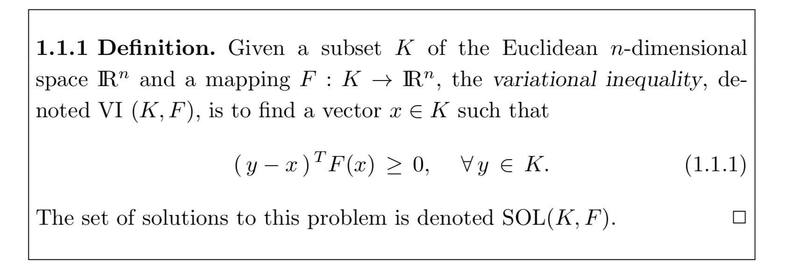

$\text{SOL}(K,F) = \{ x \;|\; (y-x)^\top F(x) \geq 0 \; \forall y \in K \}$

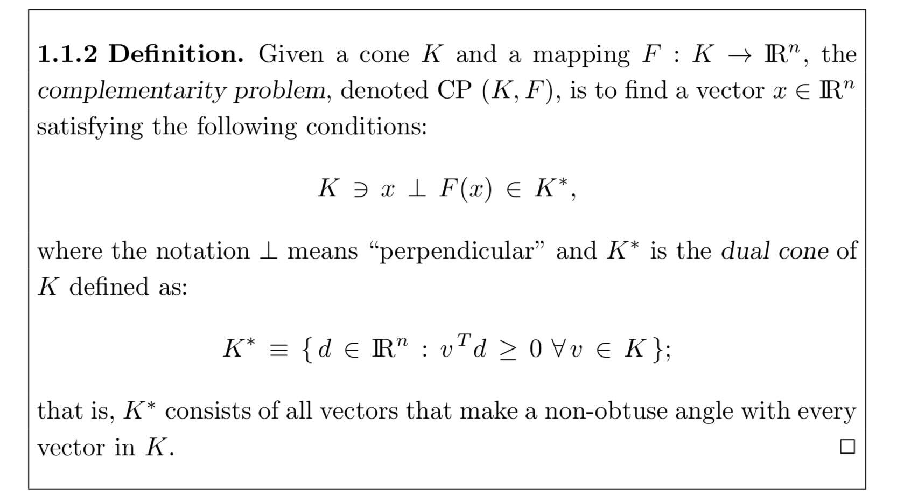

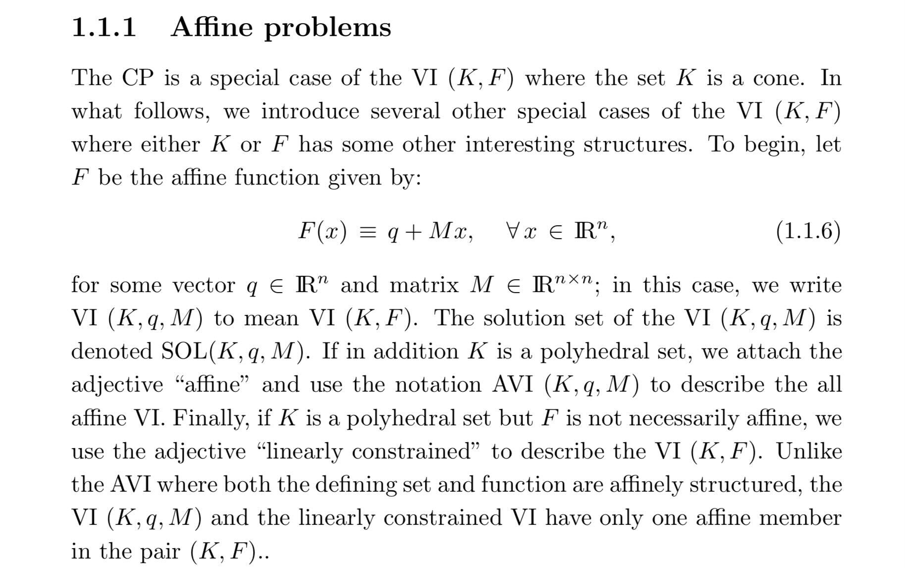

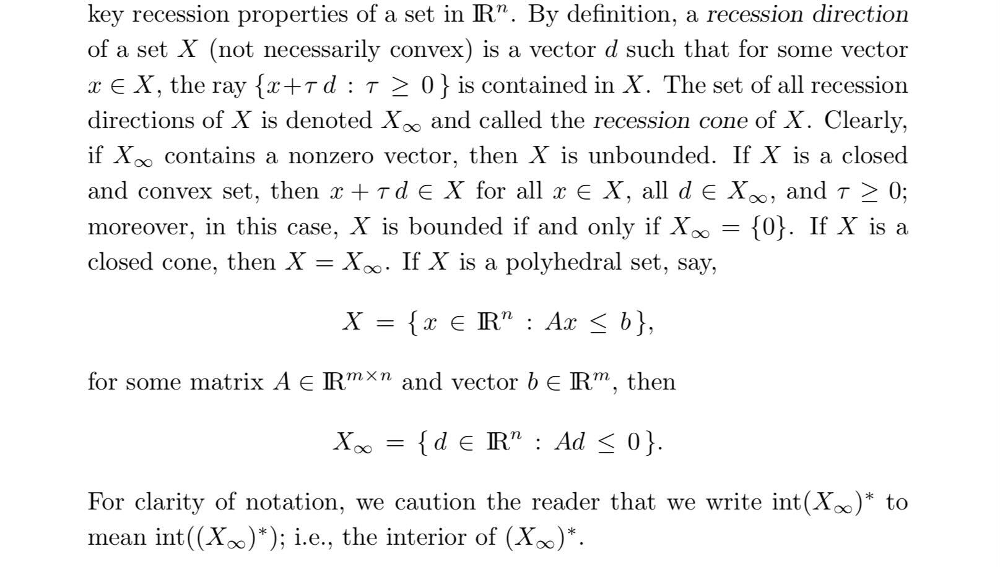

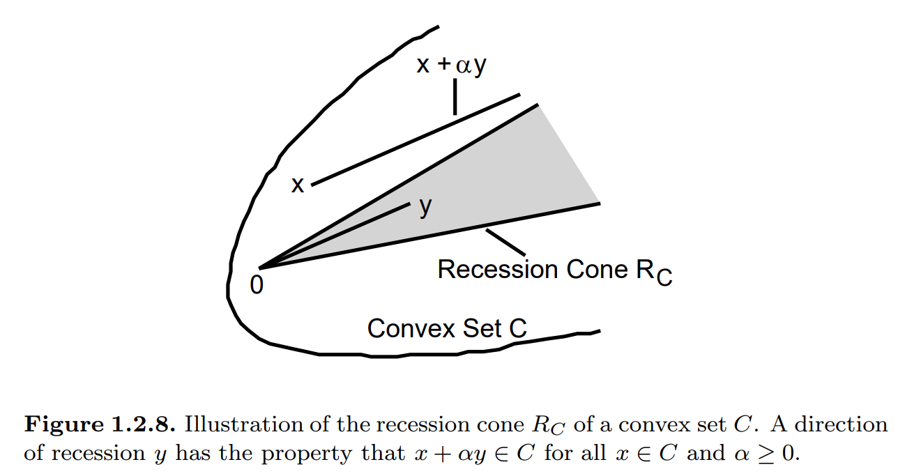
(出典: https://www.researchgate.net/publication/2486516_Convexity_Duality_and_Lagrange_Multipliers)

$K_\infty$は、$K$が無限に伸びている方向の集合。

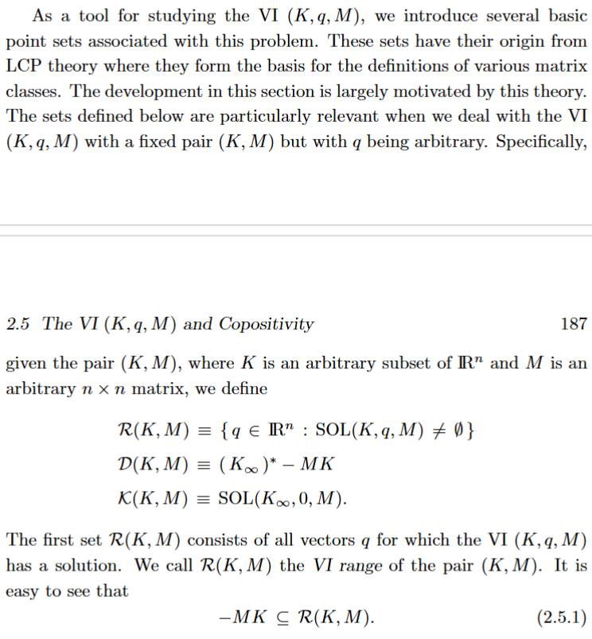

## Sec. 2.5.2

AVI range of the pair $(K,M)$: $\mathcal{R}(K,M)$

$$
\begin{align*}
\mathcal{R}(K,M) &= \{q \in \mathbb{R}^n \;|\; \text{SOL}(K,q,M) \neq \emptyset \}\\
                 &= \{q \in \mathbb{R}^n \;|\; \exists x \in K \text{ s.t. } (y-x)^\top (q+Mx) \geq 0 \; \forall y \in K\}
\end{align*}
$$

### Thm. 2.5.15

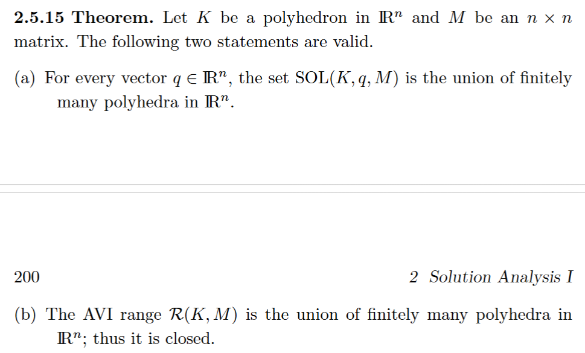

(a): 本質はThm2.4.13を使うだけ
(b): (a)を変形して、$q$の方の存在範囲に変えただけ

以下は、Thm. 2.4.13の復習
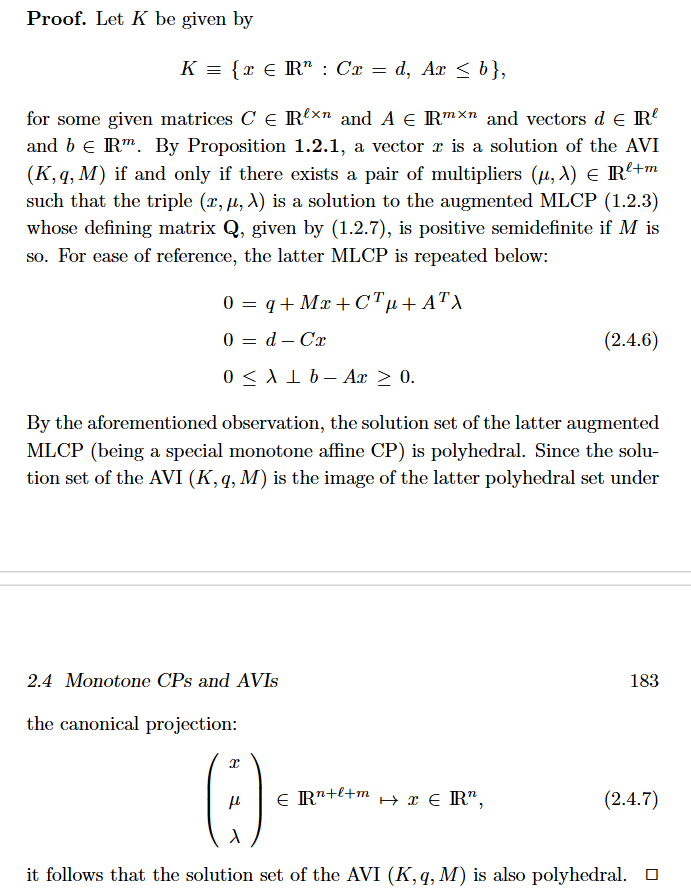

### Cor. 2.5.16

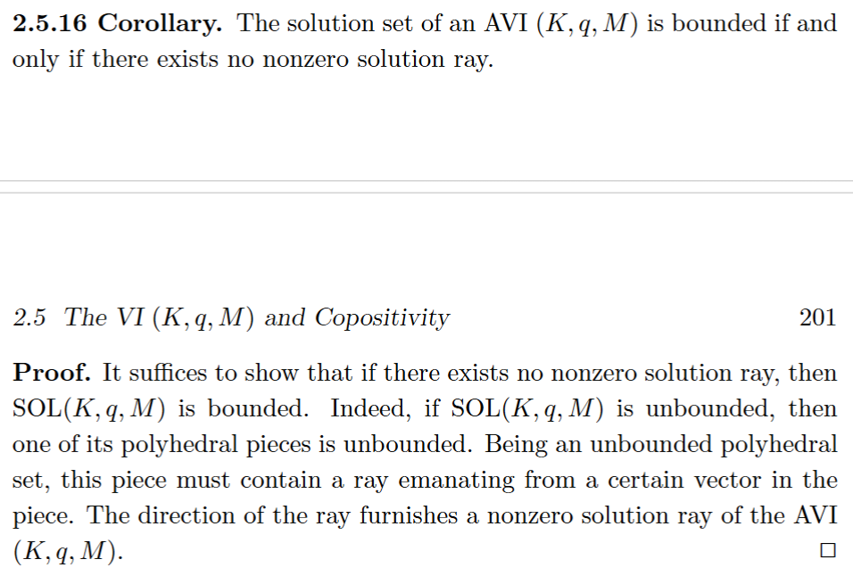

直感的にも明らかだが、

$$
(y-x)^\top (q+Mx) \geq 0 \; \forall y \in K
$$
であるとして、Prop. 2.5.4を用いれば、計算しても導かれる:

$$
\begin{align*}
& (y-x-\tau d)^\top (q+M(x+\tau d)) \\
\geq {}& (y-x)^\top (M\tau d) - \tau d^\top (q+M(x+\tau d))\\
\geq {}& 0 - 0 - \tau^2 d^\top Md \\
= {}& 0 \quad (\because d \perp Md)
\end{align*}
$$

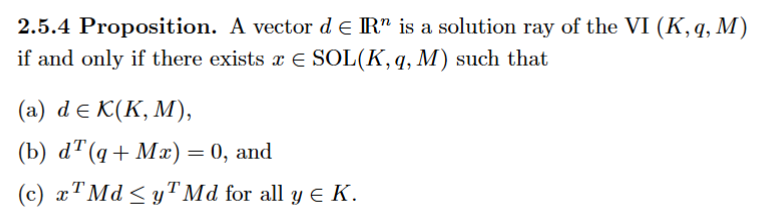

### Thm. 2.5.17

これまでに見てきた結果の精緻化にすぎない。証明もかなり基礎的。飛ばします。

大事そうな結論としては、$\text{SOL}(K,q,M)$の凸性の、同値な特徴づけが出来て、計算するときに便利ということ? (何が嬉しいのかまでは詳しく分からず)

## Sec. 2.5.3

### (2.3.4)の復習

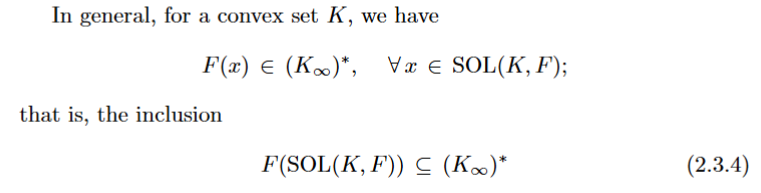

$$
x \in \text{SOL}(K,F) \iff
(y-x)^\top F(x) \geq 0 \; \forall y \in K
$$

$$
d \in (K_\infty)^* \iff
v^\top d \geq 0 \; \forall v \in K_\infty
$$

任意の$K_\infty$の元 $v$(recession direction)に対し、ある$y$が存在して、$y-x=v$ ($t \geq 0$)となるのは定義自体。

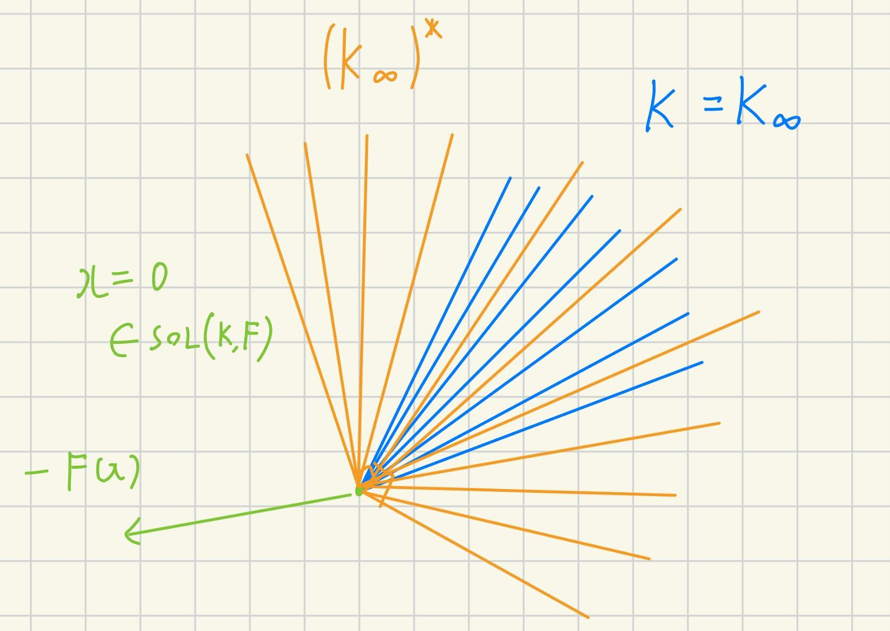

### (2.5.12)の説明

$$
\begin{align*}
& \mathcal{R}(K,M)= \{q \in \mathbb{R}^n \;|\; \text{SOL}(K,q,M) \neq \emptyset \}\\
\subseteq {}& \text{conv}(\mathcal{R}(K,M)) \\
\subseteq {}& \mathcal{D}(K,M) = (K_\infty)^* - MK\\
\subseteq {}& (\mathcal{K}(K,M))^* - MK = \text{SOL}(K_\infty,0,M)^* - MK
\end{align*}
$$

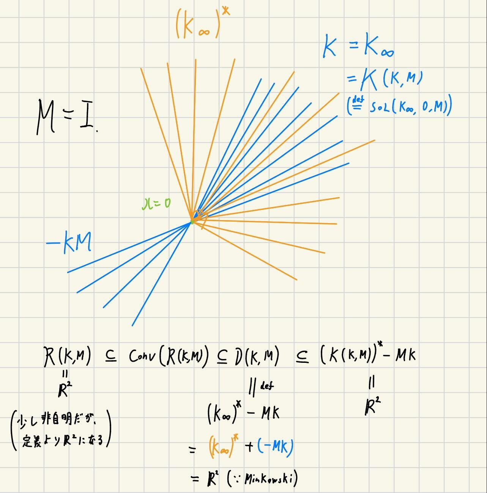

### Prop. 2.5.18

(2.5.1): $-MK \subseteq \mathcal{R}(K,M)$

(2.5.12)の等号がすべて成立するのは、(大まかにいえば)$\mathcal{R}(K,M)$が凸のときに限る。

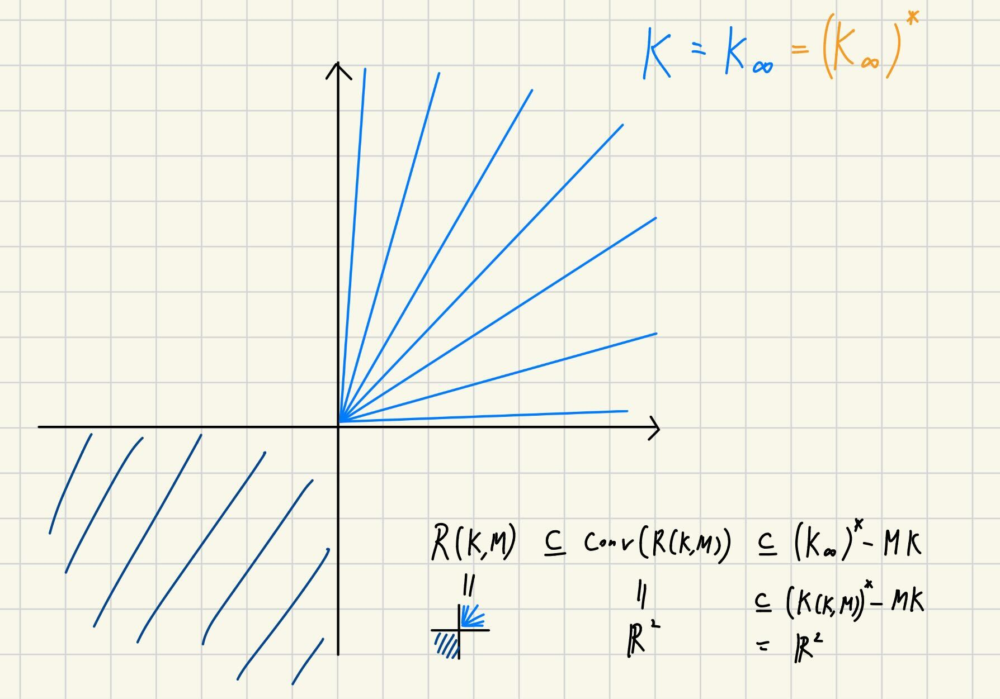

counter example: $M=\begin{pmatrix}0 & 1 \\ 1 & 0\end{pmatrix}$, $K=\mathbb{R}^2_+$

右から2番目において、$\mathcal{K}(K,M)$でなく、$(\mathcal{K}(K,M))^*$であることを除いて、証明は明らか。

### Prop. 2.5.18の意味

Def 1.1.2を思い出すと、

* solvable set: $q$ such that $\text{SOL}(K,q,M) \neq \emptyset$
* feasible set: $q$ such that $x \in K$ and $Mx+q \in K^*$

が一致している。節の名前にもある通り、"Solvability in terms of feasibility"である。

### この節の残り

この節の残りは、$K$がpolyhedral setのときに、同様の主張が成り立つことを示している。既に主張の大枠はつかめているが、"not as easy as the case of a cone $K$; ... $M$ is copositive plus on the recession cone $K_\infty$"とあるとおり、証明はかなり面倒、かつ、昔に読んだ道具を使い、更なる復習が必要。ここでは飛ばす。

(Lemma 2.5.19などは、単に定義通りで良い。Thm. 2.5.20は、先ほども扱ったpolyhedral setの具体的な表式を扱いながら式変形したり、いろいろと細かい部分のcheckをしたり、大変そうな感じ。詳細までは理解せず。)

(ここまで30分想定)

------------------------------

## Sec 2.6

* Sec. 2.4ではpseudo monotone
* Sec. 2.5ではAffine
を、それぞれ$F$に対して課してきた。

ここでは、その両方の仮定を外す。

## Thm. 2.6.1

いくつかの命題の基となる、一種の抽象的な命題である。

### natural mapとnormal mapの復習

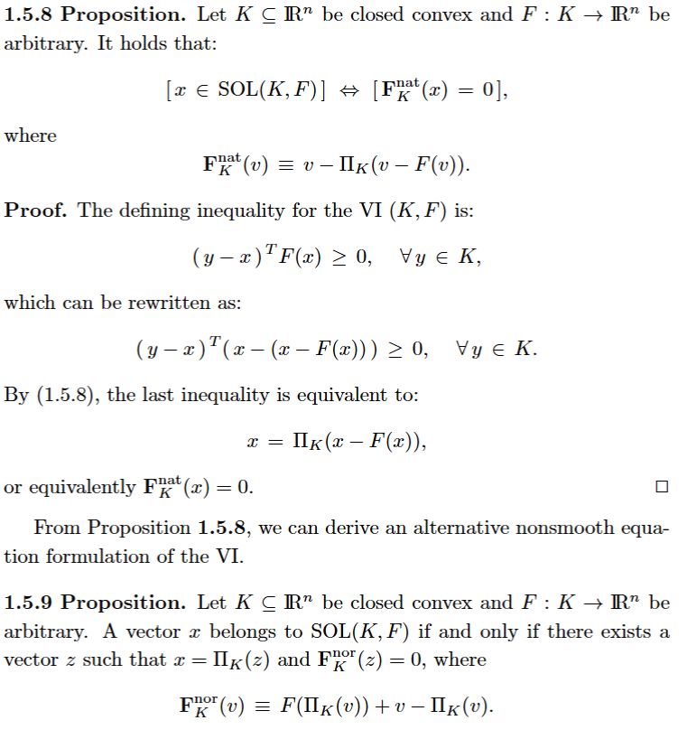

### Thm. 2.2.1の復習

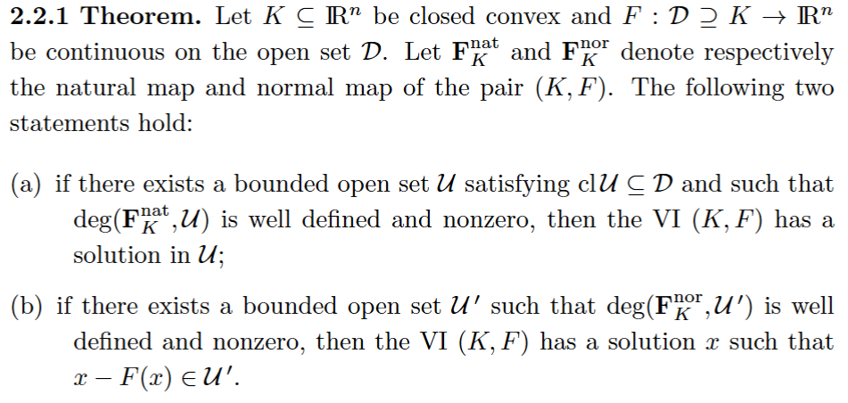

### R0 pairの復習

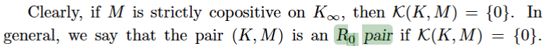

### 証明

以上を組み合わせて使うだけ

## Cor. 2.6.2

解の存在性に対する、異なる特徴づけ。自明。

## Cor. 2.6.3

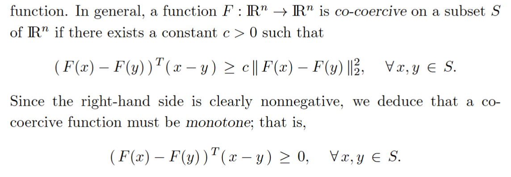

co-coercive

証明は計算するだけ

## Cor. 2.6.4

同様にほぼ計算するだけ

## Prop. 2.6.5

殆どの主張はこれまでの結果。飛ばします。

------------------------------

## Sec 2.7

We consider a discrete linear elastic, small displacement, planar contact
problem under a standard Coulomb friction law.

標準クーロン摩擦則のもとにおける離散線形弾性、小変位、平面接触問題を考察する。

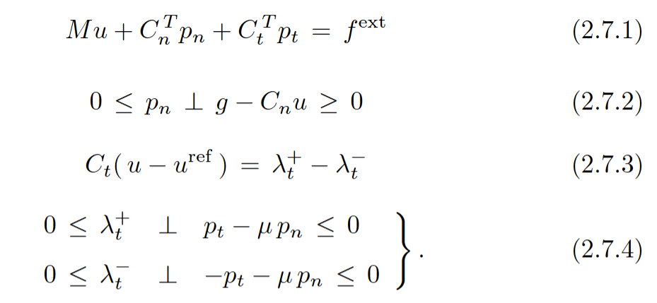

これの具体的な可解性の議論(Prop. 2.7.1, Prop. 2.7.3, Prop. 2.7.4)をしている。

最適化と殆ど関係ないので、飛ばす。
(もしご興味のある方が多ければ、次回にてお願いします。)

"more importantly,
this solution can be computed by the well-known Lemke almost comple-
mentary pivotal method"とあり、具体的なアルゴリズムはLemke法を使うことが出来るようである。

https://qiita.com/zhidao/items/ccc388e432624184c009
