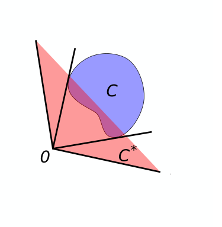
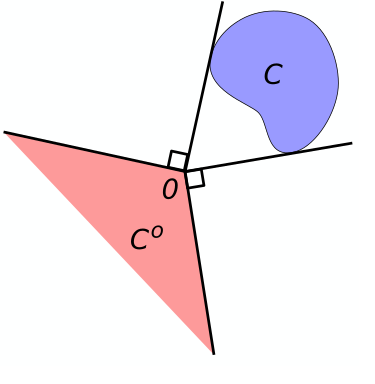

# 20250605 Finite-Dimensional Variational Inequalities and Complementarity Problems

## 1.8

基本的に定義通りに解いていけば問題がなさそうなので、各自にお任せできればと思います。(ある程度は眺めましたが、これはとても難しそう、というのを発見していません。もちろん私の難易度推定が雑なだけかもしれませんが……。)

### 1.8.15

手前味噌で恐縮ですが、ここで言われているAlgorithmに関する記事を先月書いていたので、共有しておきます。

https://qiita.com/hari64/items/23d8e8f20879871b2209

### 1.8.26

折角の図があるので触れます。

[Coulomb friction cone](https://www.cs.cmu.edu/afs/cs/academic/class/16741-s07/www/lectures/Lecture17.pdf): 静止摩擦力が働ける範囲を表す円錐。

## 1.9

ただのnoteなので飛ばします。参考文献の案内がメインのように思われます。多少のハルシネーションが含まれていますが、notebook lmによる要約を以下に示します。

### notebook lmによる要約

[notebook lmへのリンク](https://notebooklm.google.com/notebook/431b0720-c5f9-476f-af30-40387f2689db?_gl=1*1wt7fnb*_up*MQ..*_ga*MTkwNjk4ODc1MS4xNzQ4NTY0NTEx*_ga_W0LDH41ZCB*czE3NDg1NjQ1MTEkbzEkZzAkdDE3NDg1NjQ1MTEkajYwJGwwJGgw)

以下は、ソースの内容を要約した日本語の説明です。

* **基本概念と理論:**
  * **法錐 (normal cone)** は凸解析の基本的な幾何学的対象であり、制約付き最適化問題の一次必要条件と密接に関連しているため重要です。「一般化方程式」という用語は Robinson  によって作られました。
  * 特定の距離関数の**強制性 (coercivity)** に関連する複数の条件の同値性について説明されています。特に、写像 F があるプロパティを満たす場合、これらの4つの条件 (a)-(d) は全て同値になります。法写像のノルムの強制性と自然写像のノルムの強制性の間の同値性も示唆されています。
  * **法写像 (normal map)** Fnor K は Minty  が導入したとされ、Minty写像とも呼ばれます。**自然写像 (natural map)** Fnat K は Eaves  が NCP の研究に用いました。これらの写像は Robinson  によって詳細に研究されました。
  * NCP (F+q) が全ての q に対して一意解を持つ性質は「**大域的一意解特性 (globally uniquely solvable, GUS)**」と呼ばれます。これは、関連する法写像が同相写像であることと同値であることが示されています。
  * 制約想定と **Karush--Kuhn--Tucker (KKT) 条件** は非線形計画法において長い歴史を持ちます。KKT 条件は Karush  が最初に得ましたが、広く知られるようになったのは Kuhn と Tucker  の論文からです。

* **歴史的背景:**
  * 変動不等式 (VI) の解が「自身のプログラムを解く」という観察は Eaves  によるものです。
  * 準変動不等式 (QVIs) は Bensoussan と Lions  によって導入されました。
  * 一般経済均衡の数学的解析は Walras  に始まり、Arrow と Debreu がその存在を確立しました。Debreu はこの業績でノーベル経済学賞を受賞しています。Scarf  は均衡計算のための不動点アプローチで注目を集めました。
  * NCP に対する最初の存在・一意性結果は Cottle  によって得られました。
  * C-関数の理論は、Mangasarian  や Fischer 、Luo と Tseng 、Kanzow, Yamashita, Fukushima  らによって発展しました。FB C-関数は R-関数の理論に遡るとされています。

* **応用分野:**
  * サドル点問題は、ノイマン  が基礎を築いた**ゲーム理論**において重要な応用を持ちます。線形二次計画問題はサドル点問題のサブクラスです。
  * Nash 平衡概念は**寡占競争モデル**の中心であり、特に Nash-Cournot 問題は VI アプローチで解くことができることが示されました 。
  * **寡占電力モデル**の研究には VI/CP アプローチが広く用いられています。特定のモデルは MPECs につながる場合があります 。
  * **計算可能な一般均衡モデル**は、相補性方法を用いた数値解法が報告されています。
  * **交通ユーザー平衡問題**は Wardrop  の原則に基づき、VI/CP アプローチで広く研究されています。空間価格均衡問題も関連分野です。
  * **接触問題**は力学の不等式問題であり、特に摩擦接触問題において相補性方法が強力なアプローチであることが知られています。相補性の概念は物理的な接触現象と同義であるとされるほどです 。
  * **工学塑性**や弾塑性構造解析への LCP や非線形相補性方法の応用が研究されています。破壊力学におけるパラメータ同定に MPEC 手法が用いられることもあります 。
  * **障害物問題**は変動不等式の応用分野であり、フォン・カルマン薄板問題などが含まれます。
  * その他、弾性流体潤滑、TCP/IP ネットワーク、化学工学システムのモデリング、および微分代数システムと LCP を組み合わせた**工学ハイブリッドシステム** にも相補性問題が応用されています。
  * 多垂直 LCP (generalized LCP) は、抵抗性区分線形回路のモデルとして有用です。
  * **金融**分野では、アメリカンオプション価格設定問題が、LCP アプローチ、変動不等式、または偏微分相補性アプローチを用いて広く研究されています。
  * **MPECs (Mathematical Programs with Equilibrium Constraints)** は工学設計、製品ポジショニング、および金融関連の問題に応用があります。
  * **半正定値計画問題 (SDPs)** は工学制御や組合せ最適化に応用があり、SPSD 行列における LCP としての拡張も研究されています。

* **アルゴリズムと手法:**
  * **Lemke の枢軸アルゴリズム**はアフィン VI や線形効用関数を持つ経済モデルを解くために拡張されています。修正 Lemke アルゴリズムは、接触問題で Coulomb 摩擦をモデル化する際にも使用されます 。
  * QVIs の解法としてニュートン法が提案されました 。
  * 制約付き最適化問題の**勾配射影法 (gradient projection method)** の収束解析に関連して、射影勾配が使用されています 。
  * 摩擦接触問題の解法に相補性方法が用いられており、初期の研究では射影ガウス・ザイデル法  や、非線形方程式を解く主枢軸アルゴリズム がありました。
  * **ギャップ関数 (gap function)** は、単調 VI を解くための反復降下アルゴリズムの開発に広く使用されました。
  * アメリカンオプション価格設定問題に対して、様々な数値解法（LCP アルゴリズム、PDE 相補性アプローチなど）が研究されています。
  * SDP を標準 NLP として解くアイデアもあります 。
  * CPs on the Lorentz cone に対する**平滑化関数と平滑化手法**が研究されています 。

* **その他の重要な概念:**
  * **隠れ相補性問題 (implicit complementarity problem)** は、その隠れ不動点的な性質から名付けられました 。
  * 擬凸関数は Mangasarian  によって導入されました。
  * **行十分行列 (row sufficient matrices)** と **列十分行列 (column sufficient matrices)** は LCP の解集合の凸性に関する研究で重要な役割を果たします。

これらのソースは、VI/CP 理論が幅広い分野で重要な役割を果たし、その理論、歴史、応用、アルゴリズムが多岐にわたる文献で研究されていることを示しています。

## 2.1

2.1節は、

1. Degree theory (写像度) の導入
2. Local and global homeomorphisms (ホモロジー)
3. Elementary set-valued analysis
4. Fixed-point theorems (不動点定理)
5. Contractive mappings

からなります。この2.1節を読み切ることを目標とします。

### 2.1.1 Degree theory

前提知識として、代数的トポロジーに関する知識を要求されています。

枡田幹也著 『代数的トポロジー』(朝倉書店) が参考になります。

第2章にある回転数の話を先にします。写像度の特殊な場合に相当します。

第5章に写像度の話も出てきますが、元の教科書との乖離が大きくなるので触れません。

以下なども参考になります。

https://ja.wikipedia.org/wiki/%E5%86%99%E5%83%8F%E5%BA%A6

https://arxiv.org/abs/2304.06463
