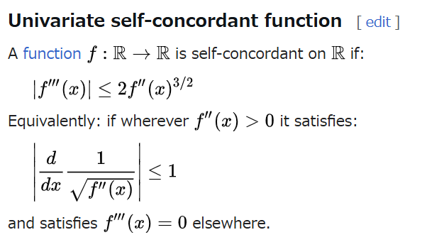
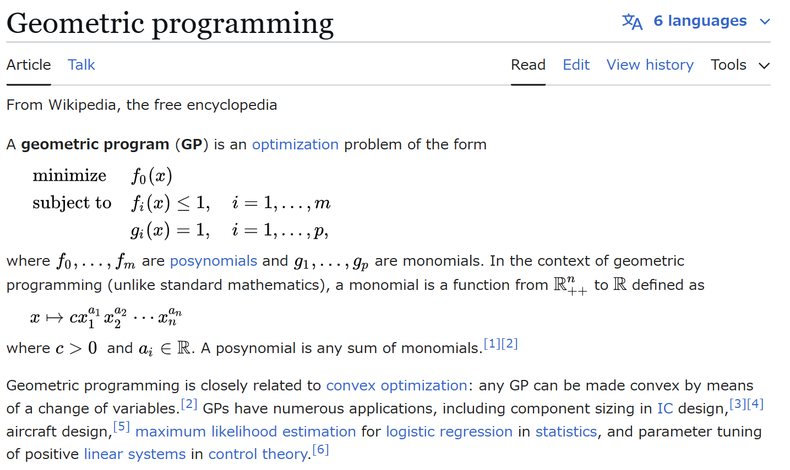
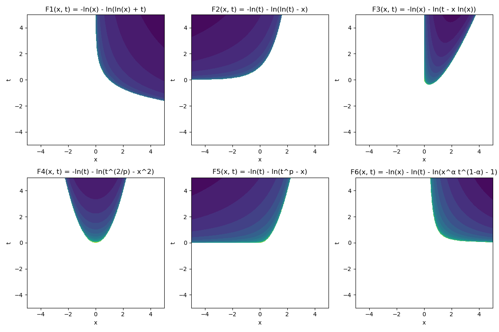
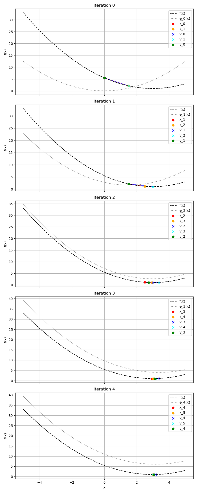
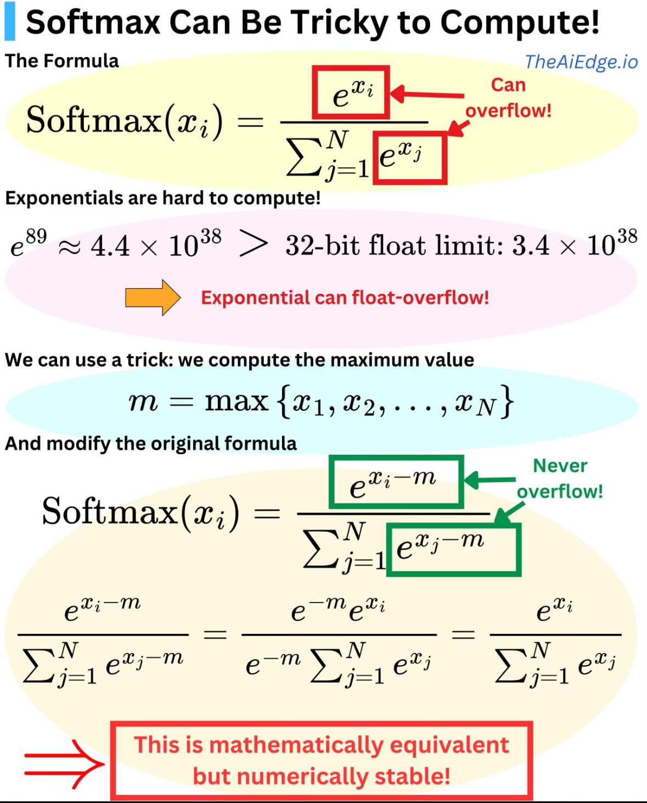
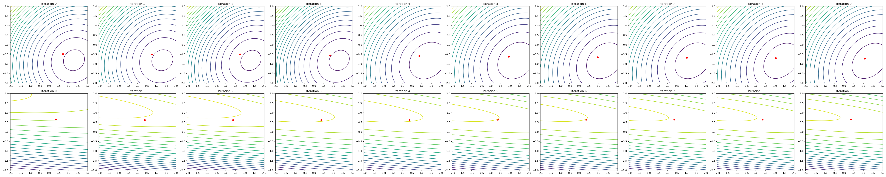

# memo

## Chapter 5

### ざっくりとした復習

- 内点法で制約付きの最適化問題を解きたい
- self-concordant barrier function を用いて、制約条件を扱いやすい形に変換する
- self-concordant functionを実際に作ろう! ← 今回の話

#### self-concordant barrier function




power cone:
$K_\alpha = \left \lbrace (x^{(1)}, x^{(2)}, z) \in \mathbb{R}_+^2 \times \mathbb{R} \mid (x^{(1)})^\alpha \cdot (x^{(2)})^{1-\alpha} \geq \lvert z \rvert \right \rbrace$

$\xi(x) = (x^{(1)})^\alpha \cdot (x^{(2)})^{1-\alpha}$

$F(x)=-\ln{x^{(1)}}-\ln{x^{(2)}}$

$\Phi(y,z) = -\ln{(y^2-z^2)}$

とした時に、

$\Psi(x,z) = \Phi(\xi(x),z) + \beta^3 F(x)$ が  self-concordant barrierになると言っている。





## Chapter 6

### abstract

- 非スムーズ最適化問題はスムーズな問題よりも難しいが、多くの場合、関数の構造が明確である。
- これを利用して、最適化手法を高速化し、双対問題の有用な情報を抽出できる。
- 本章では、非微分可能な関数を滑らかな関数で近似し、高速勾配法 (Fast Gradient Methods) を適用する方法を紹介する。
- 結果として、標準的なサブグラディエント法の反復回数の平方根に比例する反復回数で最適化が可能になる。

### 6.1 Smoothing for an Explicit Model of an Objective Function

#### 6.1.1 Smooth Approximations of Non-differentiable Functions

- サブグラディエント法では、最適化の反復回数は $\mathcal{O}(1/\epsilon^2)$ に比例する。
- しかし、ブラックボックスモデルではなく、関数の構造を活用すると、効率的な手法が構築可能。
- Fenchel conjugate を用いてスムージングを行い、関数を滑らかに近似する。
- 平滑化後の関数はリプシッツ連続な勾配を持ち、高速勾配法を適用できる。

#### 6.1.2 The Minimax Model of an Objective Function

- 目的関数が明示的に「ミニマックス」構造を持つ場合、双対問題の形で表現できる。
- これを利用し、プライマル・デュアルの両方の解を同時に求める。

prox-function: $f(y) \geq f(x) + \langle \nabla f(x), y - x \rangle + \frac{1}{2} \| y - x \|_2^2$

これを使って、Fenchel 双対を平滑化する。

#### **6.1.3 The Fast Gradient Method for Composite Minimization**

- 一般的な凸関数 \( f(x) \) に対し、高速勾配法を適用することで収束速度を向上。
- 主要なアルゴリズム:
  - 三角形類似法 (Method of Similar Triangles)
  - 関数の評価と勾配計算を交互に行い、反復回数を削減。

- 加速勾配法的な感じでもあるし、近似をどんどん作っていくという意味ではBFGS的でもある
- 特に重要なのがPrimal-Dualの管理
- リスタートとかすれば実用上は速くなりそう

大体この辺の話のらしい:
Nesterov, Y. (2005). Smooth minimization of non-smooth functions. Mathematical programming, 103, 127-152.

```Python
# 定義: 最小化したい関数とその勾配
def f(x):
    return 0.5 * (x - 3) ** 2 + 1


def grad_f(x):
    return x - 3


# パラメータ設定
L = 1  # リプシッツ定数（今回は簡単化のため 1 とする）
max_iter = 5  # 繰り返し回数
Q = [-5, 5]  # 制約領域


# プロックス関数（今回は単純化のため二乗距離）
def d(x):
    return 0.5 * x**2
```



#### **6.1.4 応用例 (Application Examples)**

- **行列ゲームのミニマックス戦略**
  - 行列ゲームにおける最適戦略を見つけるため、エントロピー正則化を適用。
- **連続配置問題 (The Continuous Location Problem)**
  - 各地点の人口密度を考慮し、社会的距離を最小化する施設の配置問題。
- **線形作用素を持つ変分不等式 (Variational Inequalities with a Linear Operator)**
  - 単調線形作用素を用いた変分不等式問題の最適解を求める手法。
- **区分線形最適化 (Piece-Wise Linear Optimization)**
  - 最大絶対値または絶対値の合計を最適化する問題の高速解法。

#### **6.1.5 実装上の課題 (Implementation Issues)**

- **計算量の評価**
  - 高速勾配法を用いることで、計算コストを削減。
- **数値計算の安定性**
  - スムージングを適用すると、小さなスムージングパラメータが数値誤差を引き起こす可能性があるため、適切な計算手法が必要。



```Python
import numpy as np


# 通常のSoftmax関数（オーバーフローの危険あり）
def softmax_normal(x):
    exp_x = np.exp(x)  # 直接指数関数を適用（オーバーフローの危険あり）
    return exp_x / np.sum(exp_x)


# 数値安定化されたSoftmax関数
def softmax_stable(x):
    m = np.max(x)  # 最大値を引いてオーバーフローを防止
    exp_x = np.exp(x - m)
    return exp_x / np.sum(exp_x)


# テスト用データ（大きな値を含む）
for x in [
    np.array([10, 11, 12]),
    np.array([100, 101, 102]),
    np.array([1000, 1001, 1002]),
]:
    print(f"{x=}")

    # 通常のSoftmaxを試す（オーバーフローが発生する可能性大）
    try:
        normal_result = softmax_normal(x)
    except OverflowError:
        normal_result = "OverflowError!"

    # 数値安定化されたSoftmaxを試す
    stable_result = softmax_stable(x)

    print(normal_result, stable_result)  # 結果表示


'''
PS C:\Users\hirok\Documents\University\BookReadingSeminarMaterials> & C:/Users/hirok/anaconda3/python.exe c:/Users/hirok/Documents/University/BookReadingSeminarMaterials/20250303/softmax.py
x=array([10, 11, 12])
[0.09003057 0.24472847 0.66524096] [0.09003057 0.24472847 0.66524096]
x=array([100, 101, 102])
[0.09003057 0.24472847 0.66524096] [0.09003057 0.24472847 0.66524096]
x=array([1000, 1001, 1002])
c:\Users\hirok\Documents\University\BookReadingSeminarMaterials\20250303\softmax.py:6: RuntimeWarning: overflow encountered in exp
  exp_x = np.exp(x)  # 直接指数関数を適用（オーバーフローの危険あり）
c:\Users\hirok\Documents\University\BookReadingSeminarMaterials\20250303\softmax.py:7: RuntimeWarning: invalid value encountered in divide
  return exp_x / np.sum(exp_x)
[nan nan nan] [0.09003057 0.24472847 0.66524096]
'''


'''
>>> math.e ** -1000
0.0
>>> math.e ** -100
3.7200759760208555e-44
>>> math.e ** -10
4.5399929762484875e-05
>>> math.e ** +10
22026.465794806703
>>> math.e ** +100
2.6881171418161212e+43
>>> math.e ** +1000
Traceback (most recent call last):
  File "<stdin>", line 1, in <module>
OverflowError: (34, 'Result too large')
'''
```

https://data-analytics.fun/2021/04/06/understanding-gumbel-max-trick/

---

### **6.2 非スムーズ凸最小化のための過剰ギャップ手法 (An Excessive Gap Technique for Non-smooth Convex Minimization)**

#### **6.2.1 プライマル・デュアル問題の構造 (Primal-Dual Problem Structure)**

- 双対問題を活用し、標準的なサブグラディエント法よりも効率的な解法を導入。
- 目的関数のミニマックス構造を活用し、収束速度を向上させる。

#### **6.2.2 過剰ギャップ条件 (An Excessive Gap Condition)**

- 目的関数の値の間に「過剰ギャップ (excessive gap)」を導入することで、収束解析を改善。
- 収束保証のある新しい勾配更新手法を提案。


