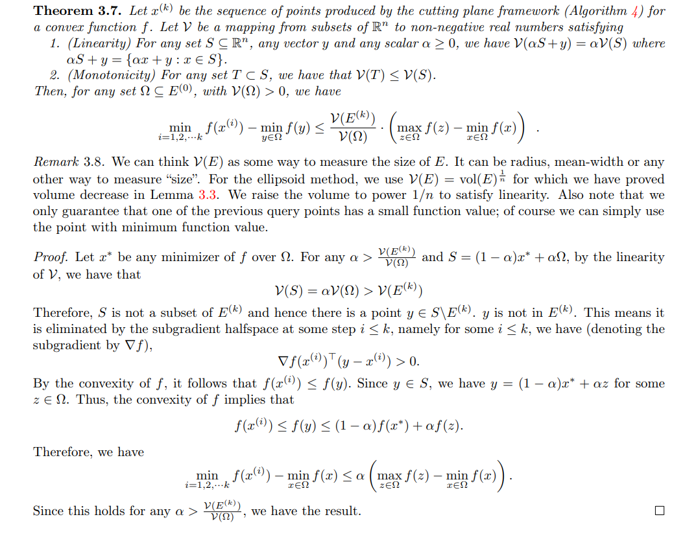

# Issue -- The proof of Theorem 3.7

Hello, I am Hiroki Hamaguchi.
Thank you very much for sharing this wonderful book.

Today, I would like to ask you about the proof of Theorem 3.7. My friends and I suspect that there may be some issues in the proof, but we have not been able to reach a definitive conclusion. We would greatly appreciate it if you could take a look at it when you have time.

This is not an urgent matter, and there is no need to reply. If possible, we would be grateful if the proof could be corrected in main.pdf at your convenience.

---

The below is the content of the issue.

(p.33 of the book)

(This Theorem and Theorem 3.9 seems to be based on your lecture notes. We also referred to this.)

https://yintat.com/teaching/cse599-winter18/2.pdf

In this theorem, we take the initial ellipsoid $E^{(0)}$ to be one that contains $\Omega$.
(We assume that $E^{(0)}$ is significantly larger than $\Omega$.)
However, in the proof, we cannot guarantee that the parameter $\alpha$ satisfies $\alpha \leq 1$, since $\alpha > \frac{\mathcal{V}(E^{(k)})}{\mathcal{V}(\Omega)}$, which can exceed 1.

If $\alpha$ is greater than 1, we can no longer use the convexity of the function $f$ as in the proof. This leads to a contradiction in the inequality

$$
f(x^{(i)}) \leq f(y) \leq (1 - \alpha) f(x^*) + \alpha f(z),
$$

where $y = (1 - \alpha) x^* + \alpha z$.

We believe that this issue might be resolved by choosing $k$ large enough so that $E^{(k)} \subseteq \Omega$, thereby ensuring that $\alpha \leq 1$. However, we are not certain whether this is the correct and intended approach.

---

Thank you for your time.
